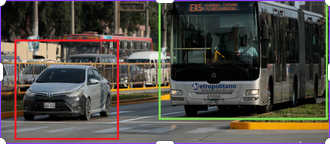

# TransitAI - Sistema de Monitoreo de Tráfico para Lima

TransitAI es una plataforma web que ayuda a las autoridades de Lima a monitorear las invasiones vehiculares en carriles del Metropolitano y buses. Usa cámaras con inteligencia artificial para detectar cuando autos particulares invaden estos carriles y envía alertas automáticas.



## Contenido

- [Acerca del proyecto](#acerca-del-proyecto)
- [Funciones principales](#funciones-principales) 
- [Tecnologías](#tecnologías)
- [Cómo instalar](#cómo-instalar)
- [Cómo usar](#cómo-usar)
- [Estructura del código](#estructura-del-código)


## Acerca del proyecto

Este sistema nació de la necesidad real que vemos todos los días en Lima: autos que se meten a los carriles del Metropolitano o de los buses, causando tráfico y poniendo en riesgo a los usuarios del transporte público.

**El problema:**
- Los autos invaden constantemente los carriles exclusivos
- Es difícil supervisar todas las rutas manualmente
- Las multas llegan tarde o nunca se aplican
- El transporte público se vuelve más lento e ineficiente

**Nuestra solución:**
TransitAI conecta las cámaras existentes con algoritmos de visión computacional para detectar estas invasiones automáticamente. Cuando encuentra una, manda alertas inmediatas a los operadores para que puedan tomar acción rápida.

## Funciones principales

### Detección automática
El sistema analiza el video de las cámaras en tiempo real y puede identificar:
- Autos en carriles del Metropolitano
- Vehículos bloqueando paradas de buses
- Patrones de comportamiento sospechoso

### Sistema de alertas
Cuando detecta una invasión, el sistema:
- Envía notificaciones por SMS y email
- Muestra alertas en el dashboard central
- Puede integrarse con las radios de la policía de tránsito
- Guarda evidencia fotográfica del incidente

### Dashboard de control
Los operadores tienen acceso a:
- Vista en tiempo real de todas las cámaras
- Mapa de Lima con las ubicaciones de incidentes
- Estadísticas diarias y semanales
- Reportes automáticos para las autoridades

## Tecnologías

El sistema está construido con herramientas modernas que garantizan rendimiento y confiabilidad:

**Frontend:**
- Angular 20 para la interfaz de usuario
- TypeScript para código más seguro
- Leaflet para mapas interactivos
- CSS moderno con animaciones

**Integración:**
- Google Maps API para ubicaciones precisas
- Soporte para diferentes tipos de cámaras
- API REST para comunicación con servidores

**Herramientas de desarrollo:**
- Angular CLI para automatización
- Karma y Jasmine para testing
- Componentes standalone para mejor modularidad

## Cómo instalar

**Requisitos previos:**
- Node.js versión 18 o más reciente
- npm para manejar paquetes
- Angular CLI instalado globalmente

**Pasos:**

1. Clonar el repositorio:
   ```bash
   git clone [URL-del-repositorio]
   cd wira-mvp
   ```

2. Instalar las dependencias:
   ```bash
   npm install
   ```

3. Configurar las claves de API:
   
   Copia el archivo de configuración:
   ```bash
   cp src/environments/environment.ts src/environments/environment.local.ts
   ```
   
   Luego edita el archivo con tu clave de Google Maps:
   ```typescript
   export const environment = {
     production: false,
     googleMapsApiKey: 'tu-clave-aqui'
   };
   ```

4. Iniciar el servidor:
   ```bash
   ng serve
   ```

5. Abrir http://localhost:4200 en tu navegador

## Cómo usar

**Para visitantes:**
La página principal muestra información sobre TransitAI, las funciones disponibles y cómo contactarnos.

**Para operadores:**
1. Hacer clic en "Acceder al Dashboard" 
2. Usar las credenciales proporcionadas por el administrador
3. Ver el panel de control con:
   - Cámaras activas y alertas actuales
   - Estadísticas del día
   - Mapa con incidentes recientes
   - Lista detallada de violaciones detectadas

**Navegación:**
- **Inicio**: Presentación del sistema y estadísticas generales
- **¿Qué es TransitAI?**: Explicación técnica de cómo funciona
- **Nosotros**: Información sobre el equipo y objetivos
- **Servicios**: Planes disponibles para diferentes instituciones
- **Contacto**: Formulario para solicitar información o demos

## Estructura del código

```
src/
├── app/
│   ├── core/                    # Servicios principales y guards
│   │   ├── guards/             # Protección de rutas
│   │   ├── interfaces/         # Interfaces TypeScript
│   │   └── services/           # Servicios singleton
│   ├── features/               # Módulos de características
│   │   ├── auth/              # Autenticación
│   │   ├── dashboard/         # Panel de control
│   │   └── landing/           # Página principal
│   │       └── components/    # Componentes de landing
│   ├── shared/                # Componentes reutilizables
│   │   └── components/        # Header, footer, modals
│   ├── app.config.ts          # Configuración de la app
│   ├── app.routes.ts          # Definición de rutas
│   └── app.ts                 # Componente raíz
├── environments/              # Variables de entorno
├── styles.css                # Estilos globales
└── main.ts                   # Bootstrap de la aplicación
```


---

Desarrollado para contribuir a un transporte público más eficiente en Lima.